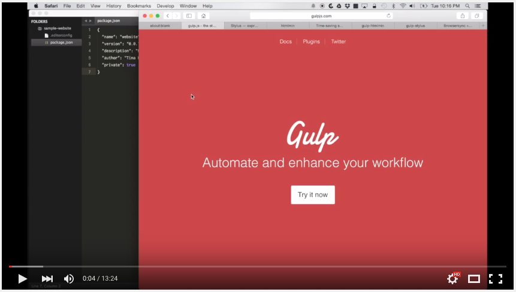

# Setting up BrowserSync with Stylus CSS preprocessing and HTML minification

This is the source code created for the [YouTube video](https://youtu.be/rdz65Pi-ZV4).

To download the project dependencies and run the project, run the following commands:

```
npm install
gulp
```

Check out the video [here](https://youtu.be/rdz65Pi-ZV4).


